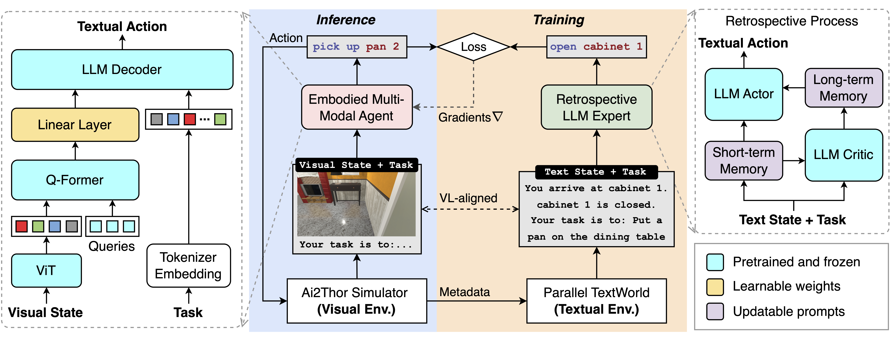

# EMMA

This repository is the official implementation of the following paper.

**[Embodied Multi-Modal Agent trained by an LLM from a Parallel TextWorld](https://arxiv.org/abs/2311.16714)**
 
[Yijun Yang](https://scholar.google.com/citations?user=X0quXnsAAAAJ&hl=en), [Tianyi Zhou](https://tianyizhou.github.io/), Kanxue Li, [Dapeng Tao](https://scholar.google.com/citations?user=AQzS40gAAAAJ&hl=en), Lvsong Li, [Li Shen](https://sites.google.com/site/mathshenli/home), [Xiaodong He](https://scholar.google.com/citations?user=W5WbqgoAAAAJ&hl=en), [Jing Jiang](https://profiles.uts.edu.au/Jing.Jiang), [Yuhui Shi](https://scholar.google.com/citations?user=xSvAHWgAAAAJ&hl=en)
 

 

## Abstract
> While large language models (LLMs) excel in a simulated world of texts, they struggle to interact with the more realistic world without perceptions of other modalities such as visual or audio signals. Although vision-language models (VLMs) integrate LLM modules (1) aligned with static image features, and (2) may possess prior knowledge of world dynamics (as demonstrated in the text world), they have not been trained in an embodied visual world and thus cannot align with its dynamics. On the other hand, training an embodied agent in a noisy visual world without expert guidance is often challenging and inefficient. In this paper, we train a VLM agent living in a visual world using an LLM agent excelling in a parallel text world. Specifically, we distill LLM's reflection outcomes (improved actions by analyzing mistakes) in a text world's tasks to finetune the VLM on the same tasks of the visual world, resulting in an Embodied Multi-Modal Agent (EMMA) quickly adapting to the visual world dynamics. Such cross-modality imitation learning between the two parallel worlds is achieved by a novel DAgger-DPO algorithm, enabling EMMA to generalize to a broad scope of new tasks without any further guidance from the LLM expert. Extensive evaluations on the ALFWorld benchmark's diverse tasks highlight EMMA's superior performance to SOTA VLM-based agents, e.g., 20%-70% improvement in the success rate.

## TODO
- [x] Release [sft dataset](https://huggingface.co/datasets/yijunyang/alfworld-sft-dataset) for ALFWorld
- [x] Release a [13b instructblip model](https://huggingface.co/yijunyang/instructblip-sft-alfworld) finetuned on the sft dataset
- [] Release imitation learning code
- [] **Note that it might be impossible to precisely reproduce our results shown in the paper due to the OAI has deprecated the LLM (i.e., text-davinci-003) we used in the experiment**. Hence, we plan to release a new EMMA trained by the replacement (gpt-3.5-turbo-instruct) via Dagger with DPO
- [] Support to train EMMA using open-sourced LLMs

## How to finetune InstructBLIP on the ALFWorld sft dataset
1. Download dataset from [huggingface](https://huggingface.co/datasets/yijunyang/alfworld-sft-dataset)
2. Install LAVIS via "pip install -e ."
3. Download pretrained vicuna-7/13b-v1.1 model from [here](https://github.com/lm-sys/FastChat/blob/main/docs/vicuna_weights_version.md)
4. Update the configuration file (./LAVIS/lavis/projects/instructblip/finetuning/alfworld_ft.yaml) to indicate the paths of the sft dataset and the pretrained model
5. "bash LAVIS/run_scripts/instructblip/finetuning/ft_caption_alfworld.sh"

